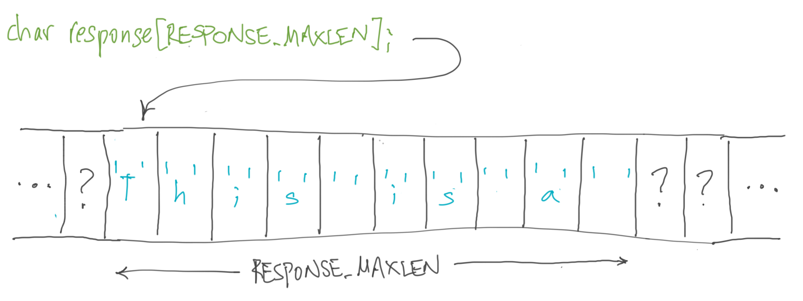

# Preface

Way to pick up C! In this third project, we are now going to tackle the _hardest_ topic in C (and any programming language where you manipulate pointers and do your own memory management).

Specifically, this project covers:

1. **Pointers** and **memory management**, which exist in every programming language. Some languages, like Python, keep these things hidden from the programmer; they do all the memory management for the programmer. C, on the other hand, leaves all memory management to the programmer.
2. **Characters** and **strings**, because they can help us understand pointers and memory management.
3. When the keyword **void** becomes a type.
4. **Indirection** and multiple levels of indirection.
5. The syntax for **for-loops** in C.

Why should you understand pointers and memory management (i.e., why should you struggle with these difficult topics)? I'll offer two reasons:

1.   Because it will help you to figure out what is going wrong when an error involving pointers and memory management appears when you're writing in a language that handles a lot of the drudgery of memory management for you. While these languages remove the drudgery and avoid some types of errors your scripts might create, they cannot insulate you from every error associated with pointers and memory management.
2.   Because you might need to write a program (as you will in CS 61 or if you do any [programming for embedded devices](https://en.wikipedia.org/wiki/Embedded_software)) where you need to access memory directly.

Unfortunately, I'm not kidding about this being a deeply confusing topic. It took me several attempts over a couple of courses before I started to feel like I truly understood it. Take your time working through this material, draw yourself pictures, and read the following paragraphs and sections as many times as you need. And most importantly, don't be disheartened if you don't get it the first or even the second time around. No one does, but with effort, you will eventually understand it!

So let's get started! 

## Feedback

This mini-curriculum is a work in progress. If you have thoughts about how it could be improved, please send them to mike_smith@harvard.edu.  If you're interested in helping improve the existing projects or create new ones, please say that in your email. I'd love the help!

## Characters

We learned in the last project that:

*   C has a character type (`char`);
*   Character literals are single characters surrounded by single quotes, e.g., `'A'`.
*   We can use a backslashed codes to specify a newline (`'\n'`) or a null character (`'\0'`) and other characters we cannot type.
*   We can treat values of the `char` type like small integers, e.g., `'\0'` has the integer value `0` and `'0'` has the value `48`.

## Active learning interlude (ali1)

Can you write a short program in `mycode.c` that prints the integer values of a character literal? This program should print the integer value of a character literal you wrote as a constant in it. If you get stuck, you can look at my solution in `solution-ali1.txt`.

## Strings

We also learned in the last project that C doesn't have a string type. We represent strings in C as an array of characters. In other words, strings are a derived type.

We have been reading the type `char *` as `STRING`, but it is now time to understand this star notation. Yes, most C programmers read `char *` as "char star," which rhymes nicely.

If I wrote the following declaration:

`char *response;`

I'd read that line to you in English as, "And here I'm declaring a variable called response that is of type char star."

This declaration looks similar to the one we used in the function `input` from the last project to capture the user's response to our prompt, "Please type a number", but in that case we declared the string variable `response` like:

`char response[RESPONSE_MAXLEN];`

I'd read that line to you in English as, "And here I'm declaring an array called response that is an array of RESPONSE_MAXLEN characters."

With both these declarations, I can get the following program to compile:

```c
#include <stdio.h>
#define RESPONSE_MAXLEN 10

int main(void) {    
    // Uncomment 1 of these 2 declarations
    // char *response;
    char response[RESPONSE_MAXLEN];

    int i = 0;

    printf("Please type something and hit return: ");
    fgets(response, RESPONSE_MAXLEN, stdin);
    while (response[i] != '\n') {
        i++;
    }
    printf("Your response was %d characters long\n", i);

    return 0;
}
```

Let's try. Copy the code and put it into `main.c`. Remember that the markdown code boxes, if you click them, will give you a copy icon in the upper right-hand corner.

Now, type `make main` in the console window. You should see two successful executions of `clang`.

Next, switch which declaration of `response` you're using in `main.c` and `make main` again. Again, two successful executions of `clang`.

Why is this? In particular,

1.   Why can we call `fgets` with `response` as the first parameter under both declarations?
2.   Why can we do an array index on `response` in the if-statement under both declarations?

To answer these questions, we have to understand the relationship between pointers and arrays.

## Pointers and arrays

The declaration:

`char *response;`

declares `response` as a _pointer to a character_.

In other words, the variable `response` doesn't store a character value, as we would get if I had declared `response` as

`char response;`

The addition of the `*` character in the declaration says that `response` stores _the memory address_ where I can find a character.


Memory addresses are like our home addresses. The latter tells you where in the world you can find me if I'm at home. The former tells you where in the computer's memory you can find a value of the type that came before the star.

The other declaration for `response`:

`char response[RESPONSE_MAXLEN];`

actually creates space in the computer's memory for `RESPONSE_MAXLEN` consecutive characters. `response[0]` names the first character in this array. `response[1]` names the second, and so on.

We can look at a picture of this new declaration. Notice how it differs from our previous two declarations of `response`.


> So what does `response` name with this declaration?
>
> The C compiler interprets `response` as the memory address of `response[0]`.

If you think hard about this, you'll realize that this is the same value that `response` names when you declare the variable as:

`char *response;`


We now only have to complete the circle. If `response` names the same memory address in both declarations, what does `response[i]` name when `response` is declared as a pointer?

> Well, if you use the square bracket notation on a pointer variable, you're asking the C compiler to perform _pointer arithmetic_.
>
> `response[i]` says take the memory address of `response` and add to it `i` times the size of this pointer's base type, which we declared as `char`.
>
> In C code, this is:
>
> `response + i * sizeof(char);`

Cool! This is exactly what we expect the index operation on an array to do, as we discussed in CS 32 and CS 50.

In summary, array declarations and pointer declarations are related. I can declare a variable, like `response`, in either manner and operate in the same way with either.

Well, almost. Let's see what the difference is between the two declarations because there is one.

## Declarations reserve space in memory

In order to hold a value in memory, the compiler has to allocate a space in memory to hold that value. This is called _memory allocation_.

> This helps to explain the difference in how we talk about variables in C and Python.
>
> *   In C, we think about variables as _locations in memory of a size determined by the type of the variable_.
> *   In Python, we think about variables as _names for an object_.
> 
> For example, let's consider the statement `x = 1`, which is a valid assignment in both C and Python, assuming that `x` has been declared as an `int` and we ignore the need for a semicolon in C.
>
> *   In C, the compiler writes the value `1` into the memory address it assigned to `x` when it saw the declaration of `x`.
> *   In Python, the interpreter creates an object (somewhere in the computer's memory, which is memory allocation!) with the value `1` and records in its table from names to objects that this object now has the name `x`.

Now let's ask, "What memory is allocated with each of our two declarations for `response`?"

*   `char *response;` -- As we discussed above, this declared `response` as a pointer, which is a memory address. The compiler, therefore, allocated a memory location for the variable `response` that is big enough to hold a memory address. We luckily don't care how big a memory address is, since the compiler will handle this for us. This is good since the size of memory addresses varies from machine to machine. We can just abstractly think about it as a memory address.

*   `char response[RESPONSE_MAXLEN];` -- This declares `response` as an array of `RESPONSE_MAXLEN` characters and reserves that many bytes in the computer's memory. Since a character is 1 byte in size, the compiler reserves `RESPONSE_MAXLEN` bytes.

Returning to my home address analogy, the first definition reserves space to write out my home address and the second reserves space for my 1350 sqft home.

And revisit the pictures above! Do they make even more sense now?

This difference is important. While you continue to think about it, let's not just compile `main.c` under each of these two declarations, but also try running it.

## C happily lets you run wild through memory

Please start with the array declaration, i.e.,

`char response[RESPONSE_MAXLEN];`

After you've updated the program with this choice, compile and run it, which you can do by just hitting the big green "Run" button.

Type "test" in response to the prompt and hit return. You should see the program complete successfully with the right answer for the length of your response.

Hit the "Run" button again, but this time type "This is a test" at the prompt (and hit return). The program will probably run to a somewhat successful conclusion, but it probably also gave a bad answer for the length. When I do this, it says that "This is a test" is a string of "7942 characters", which it clearly is not.

What happened? Remember that we allocated `RESPONSE_MAXLEN` in our `response` array. Does "This is a test" fit into this array, including the `'\n'` character we typed when we hit return? No, it doesn't, and we told `fgets` that it should read only `RESPONSE_MAXLEN` characters from the input. This means that there was no newline character in the `response` array returned from `fgets`. Our while-loop on line 13 also didn't check to see if `i` got bigger than `RESPONSE_MAXLEN`, an error condition I checked in the `input` routine from the last project.



Sigh, C assumed we knew what we were doing and it allowed us to keep reading memory far beyond the end of our declared `response` array. Eventually, we (probably) found a bit pattern in memory that looked like a newline character and the while-loop ended. Or we never did and we eventually tried to access a memory location through our address calculation that we weren't allowed to read, and in this case, the program would die with a "segmentation fault," which you'll discuss in great detail in CS 61.

## C doesn't care if you initialize a variable

Now let's try running with the pointer declaration, i.e.,

`char *response;`

After you've updated the program with this choice, click the big green "Run" button, type "test" in response to the prompt, and hit return. 

The program starts running well, but it does something unexpected after you type "test" and hit return. For me, it gave me the prompt again, and then after I typed something and hit return, I got a segmentation fault.

What went wrong? Well, if you look carefully at our program, you'll see that we sent `response` off to `fgets` as a variable with a value stored in it that the function could use, but we never gave `response` a value. We declared it, and the C compiler gave us enough memory to hold a memory address, but we never wrote an address in that allocated memory.


This is like me giving you a piece of paper on which I've written "My home address is" and then never wrote down my home address on the paper. As a human, you look at it and go, "Hey, buddy, you forgot to write your home address down." A computer-like person, on the other hand, stares real hard at the paper and makes up an address from the random photons hitting their eyes from the paper. Eventually that randomly made-up address puts them at a location where someone who isn't me gets pissed off: segmentation fault.

## Giving a value to a pointer variable

How do we solve this problem? We need to generate a memory address that corresponds to the amount of space we need for our string, which is `RESPONSE_MAXLEN` bytes as we've told `fgets` in its second input parameter.

There are _two ways_ to accomplish this:

1.   The first uses the _address-of_ operator, which is the unary `&` operator (not to be confused with the binary `&` operator, which is bitwise-AND in C).
2.   The second is to force a memory allocation using the `malloc` function.

**Using address-of.** The unary `&` operator is a nifty way to ask what memory address the C compiler assigned to any variable. For example, consider the following simple program:

```c
#include <stdio.h>

int main(void) {
    int i = 42;
    printf("%d is stored at %p\n", i, &i);
    return 0;
}
```

Copy this program into `main.c` (replacing what's there), and run it. You just learned a new format code! `%p` prints a memory address in hexadecimal.


How can we use this knowledge to fix the problem with our earlier program that defined `response` as a pointer variable? Consider this modification to our earlier program:

```c
#include <stdio.h>
#define RESPONSE_MAXLEN 10

int main(void) {    
    char an_array[RESPONSE_MAXLEN];
    char *response = &an_array[0];

    int i = 0;

    printf("Please type something and hit return: ");
    fgets(response, RESPONSE_MAXLEN, stdin);
    while (response[i] != '\n') {
        i++;
    }
    printf("Your response was %d characters long\n", i);

    return 0;
}
```

Copy this code into `main.c`, replacing anything that was there. Compile and run it by hitting the big green "Run" button. Respond to the prompt with "test".

It worked! Why?

The code declares an array as we would with the way we alternatively defined `response`. This allocated memory where we could store an array of `RESPONSE_MAXLEN` characters. We then declared our pointer variable `response` and initialized it to the address of the first byte in `an_array`. Now `fgets` had an actual place to put the response typed by the user.

> Can you draw the picture that goes with this code?

Of course, we already know from our earlier discussion that the memory address of the storage allocated when we declared `an_array` is also known as `an_array`. To prove this, change the initialization of `response` to be `= an_array`, and hit the "Run" button again.

I know that this can be quite confusing. You might want to read this stuff several times and draw pictures. You will, however, eventually get it.

**Using malloc.** In the previous example, we _statically_ allocated memory for the `response` array. This works great if you know at compile time how much memory you'll need. But what if you don't? What if you only know how much memory you'll need at run time? In this case, you need a run-time mechanism for allocating memory, and that is what `malloc` does for you.

> The function signature for `malloc` is that it is function that takes one parameter of type `size_t` and returns a value of type `void *`. To use it, you need to include the `stdlib.h` library.

Whoa, what? Let's take this one step at a time.

For our purposes here, you can think of the type `size_t` as an `unsigned int`. It is unsigned because this parameter states _how many bytes of memory we'd like allocated_, and a negative number makes no sense. It's not exactly an `int` because different machines have different sized memories and `size_t` takes care of how big this input number can get for your specific machine.

Ok, I pass to `malloc` how many bytes I'd like, and in our example, this would be `RESPONSE_MAXLEN`, since characters are 1 byte in size.

`malloc` does its work (which you'll learn about in CS 61), and returns to us a value of type `void *`. If you guessed that the star in this type indicates that the value is a pointer, you'd be right!


But what is the base type of this pointer? It is specified as `void`, but I said in the second project that `void` wasn't a type. It's not, but `void *` is.

> All we are really saying with type `void *` is that the value of this type is a pointer to raw memory.

We don't want a pointer to raw memory in our problem; we want a pointer to an array of characters. Ok, well, to tell the compiler that we just do _a type conversion_.

In C, a type conversion has the form:

`a_variable_of_type2 = (type2)a_variable_or_value_of_type1;`

Alright! We are ready to see a correct program that declares `response` as a pointer variable and dynamically allocates the storage that it points at. Copy the following program into `main.c` and compile and run it.

```c
#include <stdio.h>
#include <stdlib.h>

#define RESPONSE_MAXLEN 10

int main(void) {
    int i = 0;
    char *response;

    /* Allocate the response array */
    response = (char *)malloc(RESPONSE_MAXLEN);

    printf("Please type something and hit return: ");
    fgets(response, RESPONSE_MAXLEN, stdin);
    while (response[i] != '\n') {
        i++;
    }
    printf("Your response was %d characters long\n", i);

    free(response);

    return 0;
}
```

Yippee! It worked.

By the way, the size we pass to `malloc` doesn't have to be a compile-time constant as it is in this example program. We could generate the size we need at run time and then ask `malloc` for that much memory.

## Freeing dynamically allocated memory

I slipped one thing into the code we used to dynamically allocate memory using `malloc`. You'll see a call to a function called `free` near the end of `main`. 

> In C, every `malloc` should have a partnering `free`.

In other words, if you dynamically allocate a piece of memory at some point in your program, you should explicitly free that memory at some later point in your program.

What the call to `free` does is give the memory you earlier allocated back to the system. It's like a book you borrow from the public library. When you're done reading the book, you should return it so that someone else can read it.

With computer memory, you're returning your malloc-ed memory (when you're done with it) so that you can use that same memory space for some other `malloc` later in your program.

In our simple program, that wasn't hard. We allocated the storage for `response` at the start of the program and freed it at the end. Plus, we didn't need too much memory. Our program was never in danger of asking for too much memory from the system.

However, in a big program that runs for a long time (e.g., a web server), it is very likely you could run out of memory if you never return any of it.

Ok, I should be polite and return memory I'm no longer using. This sounds easy, but it isn't. It's easy to know when I need memory, but when am I actually done with it? And even if I know when I'm done with a piece of memory, can I put a `free` on every possible path in my program where I'm done with it?

These questions don't have simple answers for many programs, and this is why people developed languages (like Python) that take the hardest parts of memory allocation out of the hands of the programmer. Instead of the programmer figuring out mallocs and frees, she needs only to malloc memory and _the runtime system's garbage collector_ will free any unused memory (with a space and runtime overhead).

There are lots of details here that aren't helping a Python programmer learn to program in C. Just know that C will make you responsible for all the hard parts of memory allocation that you didn't have to think about in Python.

## Don't use a freed pointer!

By the way, once you free a pointer variable, don't try to use it! C will silently allow you to do this, but it's not your memory any longer. This again leads you into the world of undefined behavior, i.e., your C compiler can do anything it wants with your code that doesn't abide by the semantics of the C language. An interesting design choice, but it is a reality that you have to debug.

## Indirection

I next want to move beyond strings and talk about pointers in general.

> Pointers are powerful because they allow us to use indirection in problem solving.

What do I mean? Let's consider the difference between what computer scientists mean when they talk about _arrays_ and _lists_.

Both of these data structures allow me to keep track of a _sequence of things_, like the characters in a string or the objects on my bookcase. However, their implementations are quite different.

With **an array**, once I know where the first element sits in memory I can immediately calculate the memory address of the element _i_ by doing some simple address arithmetic, as we discussed earlier. I can do this because the elements of an array sit contiguously in the computer's memory; I need know only the starting address of the array and the index of the element you want (plus the size of the elements).

In **a list**, each element also sits in memory, but these elements do not have to be contiguous. I know what follows the element _i_ because the ith element contains not only the value of element _i_, but also a pointer to the element _i+1_.

The two implementations for the same sequence abstraction make certain operations efficient in one, but not necessarily the other. For example,

*   **Lookup element _i_** is an efficient operation (i.e., _O(1)_ time) in an array, but an inefficient operation (i.e., _O(n)_ where _n_ is the number of elements in the sequence) in a list. If I know the address of the first element, I can use it to go immediately to element _i_ in an array, but I must access every element before _i_ to get to element _i_ in a list.
*   **Insert element at location _i_** is, on the other hand, an effient operation (i.e., _O(1)_ time) in a list, but an inefficient operation (i.e., _O(n)_) in an array. Inserting an element at location _i_ in an array requires me to move all elements at indices greater than _i_, but inserting an element at location _i_ in a list requires me to only update two pointers (i.e., the pointer from element _i-1_ to _i_ and the pointer in the new element to point to the old element _i_).

Lists use indirection to make insertion operations efficient. It will help if you draw some pictures.

We will dive into lists in the next project, and so don't worry if you don't completely understand this right now.

## Dereferencing a pointer

We have used one method in C to _dereference_ a pointer, and that is using the syntax for indexing. But indexing is natural for objects that are arrays (or more generally, sequences). What if I have a pointer to a value of a simple type like `int`, as I had in our earlier example?

```c
#include <stdio.h>

int main(void) {
    int i = 42;
    printf("%d is stored at %p\n", i, &i);
    return 0;
}
```

Let's make this program a bit more complicated and useful. What if I wanted to write a function that incremented an integer variable _in place_? In other words, I didn't want to pass the value of one of my local variables to this function, but I wanted to have the function do its work directly on my local variable. We can't normally do this because the locals in one function are not names known in another function.

This might make more sense if you see the code:

```c
#include <stdio.h>

void inc(int *j) {
    *j = *j + 1;    
}

int main(void) {
    int i = 42;
    printf("%d is stored at %p\n", i, &i);

    inc(&i);
    printf("%d is stored at %p\n", i, &i);

    return 0;
}
```

I've added a new function called `inc` that takes a single input parameter of type pointer-to-an-int. This function doesn't return any value.

The only operation it performs is to increment a value by 1, but what value?

It's not incrementing the value of its formal parameter because I've specified `*j` not plain `j`. Here, the star is acting as a unary operator, like a minus sign. This operator can be applied to pointer variables, and what it says is that the value we want is not the value of the pointer variable, but the value at which the pointer variable points.


On the left-hand side of an assignment operator (`=`), `*j` says to store the result of the right-hand side where `j` points. Notice that this is the normal difference between the use of a variable on the right- and left-hand sides of an assignment operator in C. For example, `i = i + 1` says take the value in `i` (i.e., at the address of i), add `1` to it, and store that result at the address of `i`.

Go ahead and copy this code into `main.c`. Compile and run it to prove that it acts as I describe. Feel free to play with this code.

## The operation of `fgets`

I explain all this not because the last program is something you'd often do, but it is something you'd do if `i` was a really big object (which you didn't want to copy around as you made function calls) or if at compile time you didn't know the size of one of your parameters. Both these reasons are why `fgets` takes a pointer as its first parameter.

In English, we pass a pointer to the starting address of a character array when we call `fgets`. This array can be of any size we wish, and we'll tell it how big that array is using the second parameter to `fgets`. `fgets` takes this pointer and starts filling in the string, _in place_!

When it returns, our calling function doesn't have to copy any returned result into its desired array. `fgets` put it where we asked. The power of indirection! With the confusion of pointers, address-of operators, and dereferencing.

## Double indirection

Here's a weird question: Can I write `--1` in C?

Go ahead and try by changing the `inc` function in your current `main.c` file to be the following:

```c
void inc(int *j) {
    int k = --1;
    *j = *j + k;    
}
```

You should get a red squiggle under the `--` meaning that this isn't legal C code and that compilation will fail.

Of course we humans know what this means: two negatives make a positive.

To state this in legal C, you have to use parentheses, as follows:

```c
void inc(int *j) {
    int k = -(-1);
    *j = *j + k;    
}
```

This code should now compile and run.

I show you this because you can write something like `**p`, where `p` contains a pointer to a pointer.

You could create a pointer to a pointer by taking the address-of (`&`) a pointer variable, or by declaring a variable with two stars. Here's [a pointer to a Tutorialspoint lesson](https://www.tutorialspoint.com/cprogramming/c_pointer_to_pointer.htm) on this idea, in case you're interested.

## Active learning interlude (ali2)

I hope you have learned a lot in this project, but I also know that most of the work you did involved copying code I wrote. Before we leave this project, I'll give you an opportunity to read some C code and translate it into Python. This C code will use a for-loop, so that you can see that syntax in C, along with pointer operations. This will help you test your understanding of what we've covered. But to get really comfortable with pointers in C, you will have to start writing your own code and grappling with the syntax and concepts.

The piece of C code below takes a string literal, which are immutable in C, and copies it into a new character array, which I can modify. I modify the string and then print it.

Here are a few more details you should understand as you read through the code:

*   You'll notice that I pretend that I don't know the size of the string literal so that I have to compute the length of the literal in order to know how much space to dynamically allocate. I use a for-loop to perform this computation; the next section describes the format of for-loops in C.
*   After this for-loop, the loop variable (`i`) will contain _the number of visible characters in the string plus 1_. As we discussed in the last project, strings in C end with a null character (`'\0'`), and the for-loop increments `i` up the index of the character containing the null character in string literal.
*   When I call `malloc`, however, I add `1` to `i` when I specify how many bytes of memory I'd like. This extra `1` is to convert from `i` as an index into the last character (i.e., the null character) into `i` as the size of the memory I need to hold the entire string literal. Beware these two "off by one" errors (i.e., not counting the null character and treating the last index as an array's length). Unlike Python, C will silently let you write beyond the end of your arrays.
*   The next block of code uses a single for-loop to walk through both the original string literal and our newly allocated array. In the section that follows, I explain the syntax. For now, I'll just say that the body of this for-loop does a whole lot of pointer dereferences to check and copy the characters from the string literal into our allocated array.
*   What change do the if-statements in the body of the second for-loop make in the string? I leave it as a little puzzle for you to figure out.
*   We are almost done! Since this second for-loop stops when it hits the null character in the string literal, I need to write a null character at the end of my new string. I take advantage of the fact that `i` is still the index of this null character. In full disclosure, I forgot to do this when I first wrote the code. See, even experienced C programmers have trouble managing every byte of memory! Oh to be writing in Python again!
*   To end, I print the string I placed in the dynamically allocated array, and I free the memory I dyamically allocated. Don't forget this `free`!

```c
#include <stdio.h>
#include <stdlib.h>
#include <stdbool.h>

int main(void) {
    /* s1 points at a string literal, which
     * are read-only in C */
    char *s1 = "I'm a knowledgeable C programmer!";

    /* Calculate the size of the string
     * pointed at by s1 */
    int i;
    for (i = 0; s1[i] != '\0'; i++) {
        /* do nothing */
    }

    /* Dynamically allocate space for s1 */
    char *s2;
    s2 = (char *)malloc(i+1);

    /* Make a small, but important change to s1
     * as we place it into s2. */
    bool make_upper = false;
    for (char *p = s1, *q = s2; *p != '\0'; p++, q++) {
        if (*p == 'k') {
            make_upper = true;
            *q = 'K';
        } else if (make_upper) {
            if (*p == ' ') {
                make_upper = false;
                *q = *p;
            } else {
                *q = *p - ('k' - 'K');
            }
        } else {
            *q = *p;
        }
    }

    /* End our new string with a null character */
    s2[i] = '\0';
    
    /* Print our modified string */
    printf("%s\n", s2);

    free(s2);    /* Why didn't I free s1? */
    
    return 0;
}
```

After you finished your first read through the C code above, copy this code and have it replace whatever you've left in `main.c`. Then compile and run `main.c`. Does running the code help you see how the second for-loop changed the string literal?

## For-loops in C

Before you try writing a Python script with the same behavior as this C program, I'll explain the syntax of C for-loops and discuss the two examples in the code above.

Let's start with **the first for-loop**, which just counts the number of characters in the string literal pointed at by the variable `s1`.

Most for-loops you write will look a lot like this one.

Inside the parentheses, we have a single loop variable, which I've called `i`. I declared `i` before the loop, but I could have declared it as I initialized it, as you'll see in our next for-loop example. The difference is important. If your loop variable is only ever needed in the loop, you can declare it inside the parentheses of the for-loop. If you need to know the loop variable's ending value after the loop, as I did, you should declare it before the for-loop. This is scoping interacting with the block structure of C code, which we didn't really encounter in Python.

The parentheses in a for-loop contain three things. We just talked about the first, which is _the loop variable (or variables) initialization_. The second thing is _the ending condition_, and the third things is _the step code_. All three of these things exist in Python for-loops, just in a different form.

Each of these three things in a C for-loop is _separated by semicolons_, as if they were independent statements.

So, my first for-loop initializes the loop variable `i` to `0`, which is the first index value I want to check. The loop increments the loop variable by `1` after each loop iteration, because I want to check each sequential index. The loop ends when using `i` to index the string literal I find the string's terminating null character.

Since I just described all the work I want this loop to do, there's no work needed in the body of this for-loop. I just put a comment inside the curly brackets, which encapsulate the statements in the for-loop's body.

But I could have just written this:

`for (i = 0; s1[i] != '\0'; i++);`

This for-loop also has an empty body. I simply need to replace the `{ }` with a `;`.

Ok, let's tackle **the second for-loop** in the code above, which appears scarier.

It declares its two loop variables as pointers to a character, and it initializes one loop variable to the value of the pointer pointing at the start of the string literal and the other to the starting address of the dynamically allocated array.

I increment these pointers on each loop iteration, which moves each pointer by a character.  This is pointer arithmetic, which you'll discuss more in CS 61. In brief, the C compiler is smart enough to translate an auto-increment of a pointer variable into the equivalent of a index increment.

> Notice that you separate two C statements in the part of the for-loop that performs "the step work" by a comma, not a semicolon as you would in separating normal C statements.

The ending condition dereferences the loop variable `p` and checks to see if that character (in the string literal) is a null character. If it is, the loop exits.

> Remember that the star in a pointer declaration is different than a unary star operator in a C statement (or second and third parts of a C for-loop).

Yea, that was a lot, but if you understand it all, you really understand pointers. Good work!

## ALI2, revisited

Don't forget to try writing the code we've been reading through as a Python script. I've placed my answer in `solution-ali2.txt`. You'll want to create a separate Replit project that is for Python code in which you try to create your own solution. Good luck!

## Summary

In this lesson, you learned that:

1.   String types in C are actually a pointer type. The value of such a pointer is the memory address of the first character in a character array.
2.   A correctly structured string in C must end with a null character (`'\0'`).
3.   The name of a variable declared as an array in C acts like a pointer, pointing to the first element in the array, and we can use C's array indexing syntax on a variable declared as a pointer.
4.   Declaring a pointer variable only allocates space to hold a memory address. It doesn't create space for whatever we want this pointer to point at.
5.   Declaring an array variable using square brackets in a declaration statement does create storage for the declared array.
6.   We use `malloc` to create storage, and after type conversion, store the returned value from `malloc` in a pointer variable.
7.   We must `free` any storage that we `malloc`.
8.   It is very easy to create buggy programs when we do our own memory management. But we can make a correct program run super fast because there's never any extra work inserted by the compiler/interpreter to check if we are trying to do something sensible!
9.   We can use C's address-of (`&`) operator to get the memory address of a variable or piece of a derived type (e.g., an element in an array).
10.   `void *` is a type, and a value of this type is just a memory address of an untyped piece of the computer's memory.
11.   Pointers are really useful when we don't want to copy around large blocks of data.
12.   It is possible to have many levels of indirection in a C program, although I didn't discuss this in any detail.
13.   You can write for-loops in C.
14.   There are many ways to get an off-by-one error when dealing with memory allocation and creating your own C strings.
