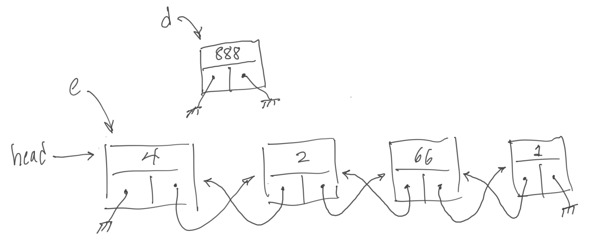
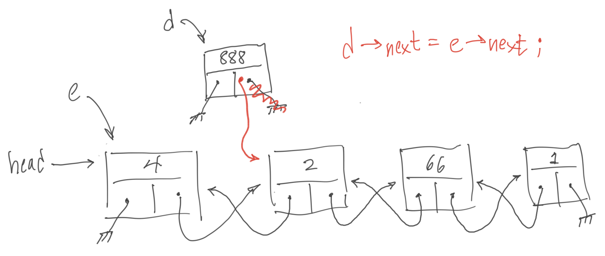
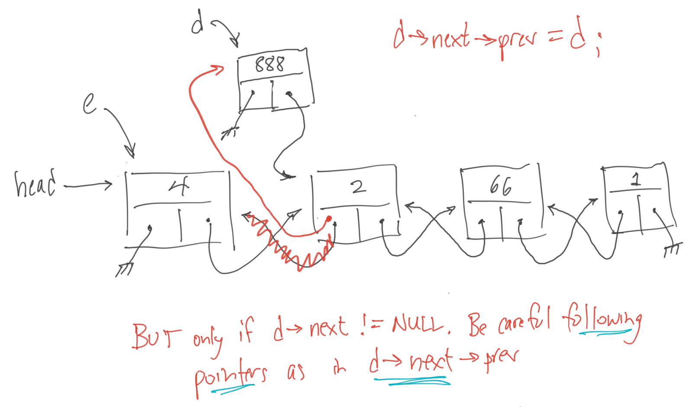

# Preface

In the fourth project, we returned to the comfortable (as Python programmers) world of object-oriented programming (OOP) and learned some basics about writing in C++, which is an object-oriented language. This fifth and final project ties all of the previous projects together and focuses on data structures. It:

1.   Looks at array types in C++
2.   Gets you started building your own C++ classes
3.   Provides more practice with pointers and looping

As I mentioned earlier, there is a lot more to the C++ programming language, but with the foundation you'll have after completing this unit, you can pick up what you need from the numerous resources available across the Internet. I'll mention some specifics places you might want to start at the end of this project.

## Feedback

This mini-curriculum is a work in progress. If you have thoughts about how it could be improved, please send them to mike_smith@harvard.edu.  If you're interested in helping improve the existing projects or create new ones, please say that in your email. I'd love the help!

## Arrays

Arrays are an extremely important, useful, and common data structure in computer programming. As you know, an array is a sequence of elements with all the same type. A canonical example of an array is a string comprised of ASCII characters (each 8-bits in size). Or we might have a 12-element array of floating-point numbers, where each element in the array corresponds to how much I was paid each month last year.

In C++, we can declare a statically allocated array and initialize it using a curly-braced initializer list, as illustrated below:

```cpp
double compensation[12] = {4.50, 8.75, 6.10, 3.14, 5.55, 4.50,
                           6.90, 7.25, 5.00, 4.80, 3.60, 1.00};
```

You might want to specify, as I did above, both the size of the array and a fully-populated initializer list. In this way, the compiler will check to make sure that the size specified equals the number of initialization values. If they differ, you'll get a compile-time error.

If your array only needs to be as big as the number of elements you put in the initializer list, you can leave out the declared size, and the compiler will assume you meant a size equal to the number of initializer elements.

```cpp
double compensation[] = {4.50, 8.75, 6.10, 3.14, 5.55, 4.50,
                         6.90, 7.25, 5.00, 4.80, 3.60, 1.00};
```

> Recall that the elements of an array are stored sequentially in memory so that if we know the base address (i.e., the memory address of the 0th element in the array), we can quickly calculate the memory address of any other element with a simple arithmetic calculation involving the array's base address, the size of an array element in bytes, and the array index of element we wish to access.

Like most programming languages, C and C++ supports the creation of multidimensional arrays, or an array of arrays, which themselves might be arrays of arrays. Notice that each array element must continue to be the same size (e.g., a 2-dimensional array must be rectangular).

For example, if I wanted to track how many miles I walked with my dog each day of the year, I might organize it by months and days as follows:

```cpp
double miles_walked[12][31];
```

Notice that I needed to make the second dimension (i.e., the number of the day in the month) as big as the largest number of days in any month. This means that this 2D array will have 5 months in the year in which I don't use all of the days in the month array, and that's ok.

We already know how to index into a 1D array using square brackets, and the syntax for a multidimensional array just repeats the square brackets for each dimension. For example, to record that my dog and I walked 2.2 miles on April 1st, I'd write:

```cpp
miles_walked[3][0] = 2.2;
```

Remember that arrays in C/C++ are zero-indexed, just like they are in Python. In fact, Python uses the same syntax (minus the semi-colon)!

## Active learning interlude (ali1)

How would you think you would declare and initialize a 2D array in C++? HINT: Think an array of arrays.

Let's pretend you want to build a 2D array in which you were going to keep your hourly appointments during your business week. Let's work bankers' hours (9am-4pm, including lunch at noon) and not work on the weekend.

For each slot, put the name of the person with whom you're meeting in the initializer list. If you're free that hour, initialize the slot with the empty string.

See if you can write a program that prints your schedule for a particular week, where the schedule is given in the program as an initializer list. Print it like a week-view in Google Calendar (i.e., as a 2D rectangle). You might want to revisit that pointer to the `setw` manipulator documentation in the last project.

You can use `mycode.cpp` to write, compile, and test your solution. When you're done, you can see my solution in `solution-ali1.txt`.

## Dynamically allocating an array

When we declare a named array (or any named variable) in one of our functions like this:

```cpp
void my_func(void) {
    double miles_walked[12][31];
    // ...
}
```

The compiler reserves space in this function's stack frame for the array. We saw this in action when we used [the Python Tutor code to help us visualize what takes place during a function call](https://pythontutor.com/visualize.html#mode=edit). The tool also works for C++ programs, if you want to give it a try.

No matter how many times we call `my_func`, or even if we call it recursively, each called instance of the function will have its own copy of `miles_walked`. This is why a variable like `miles_walked` is called a _stack variable_ or a _local variable_. It is also called an _automatic_ variable because its allocation and deallocation is handled automatically (i.e., by the function call mechanism).

The _stack_ is a designated piece of a program's memory, and it is separate from the program's _text_ segment, where the program's instructions are stored, and the program's _data_ segment, where the program's global variables are stored (i.e., those variable declarations not in a C/C++ function).

There is one other major piece of a program's memory, and that is its _heap_. The heap is where memory blocks come from when we dynamically allocate memory during a program's execution. In languages like C and C++, we (the programmers) have to manage the memory in the heap. In languages like Python, a piece of the runtime system that manages our program's execution takes care of managing our program's use of the heap.

So, how do we dynamically allocate an array in C++? Well, it looks a lot like the way we used `new` and `delete` to manage the dynamic allocation of any simple type or object, except that we add:

*   square brackets (i.e., to indicate that we want an array); and
*   a value in those square brackets (i.e., to indicate the number of elements in that array).

Let's dynamically allocate (and free) a 1D character array and then our 2D `miles_walked` array:

```cpp
void my_func(void) {
    // Declare two pointer variables
    char *pstring;           // A pointer to an array of characters
    double **double parray;  // A pointer to an array of pointers!

    // Dynamically allocate the 1D array, which is straightforward
    pstring = new char[72];

    // Dynamically allocate a 2D array, which is not straightforward
    // WRONG: parray = new double[12][31];
    // RIGHT: Allocate an array of pointers and then an array of
    //        `double` FP numbers for each pointer in the first array
    parray = new double*[12];
    for (int i = 0; i < 12; i++) {
        parray[i] = new double[31];
    }
    
    // ... do some work with these arrays
    parray[3][0] = 2.2;   // We walked 2.2 miles on April 1st

    // Free our dynamically allocated 1D array
    delete [] pstring;

    // Free our dynamically allocated 2D array
    for (int i = 0; i < 12; i++) {
        delete [] parray[i];
    }    
    delete [] parray;

}
```

You'll have noticed a couple of things in the code block above. First, the syntax for freeing a dynamically allocated array adds `[]` between the keyword `delete` and the name of the dynamically allocated array we want to free.

You'll also notice that it isn't easy to dynamically allocate a multidimensional array. We have to do it in pieces. You start by allocating the outermost dimension, which is an array of pointers. Once you have that memory, you can set each element in that outermost array with a pointer to arrays of size of the innermost dimension. And each of these dynamic allocations is not of a pointer type (although what you get back from `new` is a pointer), but the base type of the original "two-starred" declaration.

When it comes to freeing this dynamically allocated 2D array, we follow the process in reverse. We free each of the dynamically allocated innermost arrays, and then (and only then) free the single outermost array.

Yea, not pretty, but it works. It's also difficult to understand at first. Please do spend some time with the code above.

## Active learning interlude (ali2)

Good work, but just reading the previous section won't make it stick in your brain. Your next challenge is to rewrite your ali1 code to:

1.   dynamically allocate a 2D array of size `[DAYS][HOURS]`;
2.   copy each value of `schedule[i][j]` into `parray[i][j]`, where `parray` is the name of your dynamically allocated 2D array;
3.   change the print loop you wrote for ali1 to use `parray` instead of `schedule`; and
4.   free all the memory you dynamically allocated.

Your solution to ali1 is probably still in `mycode.cpp`. Start changing it! When you're done, you can see my solution in `solution-ali2.txt`.

## Building a stack data structure

You'll recall that a _stack_ in computer science is a last-in, first-out (LIFO) data structure. It operates like a stack of dishes; you can only add to or remove from the head of the stack.

We can build a stack on top of a _list_ data structure. In a list, you are allowed to insert and remove items from any location in the list. But given a list data structure, we can build a stack data structure by constraining its functionality. In the world of object-oriented programming, if we have a class that implements a list, we can derive a stack class from that list class by restricting how we are allowed to add and remove elements (i.e., only from the head of the list).

Now, C++ provides us with [`std::list`](https://cplusplus.com/reference/list/list/) and [`std::stack`](https://en.cppreference.com/w/cpp/container/stack) classes, but let's build our own list and stack classes so that we can:

*   discuss the different parts of a C++ class declaration and definition, and
*   gain more practice with pointers.

It's finally time to look at the code in `main.cpp`. This file contains three class definitions and a `main` routine that tests the functionality of the `DList` and `Stack` classes.

## A simple class

Let's start by looking at the simplest class in `main.cpp` (at the top of the file), which defines the class `Elem`. Objects of this class are the elements in a list object of class `DList`, which stands for doubly-linked list and is something we'll look at in a few moments.

If we were to write this class and its methods in Python, it would have looked like this:

```python
class Elem():
    def __init__(self, i=0):
        self.data = i     # just some data held by this elem
        self.next = None  # next elem in list
        self.prev = None  # previous elem in list

    def print(with_newline=True):
        print(f"data = {self.data} ({self.prev},{self.next})",
              end=('\n' if with_newline else ''))
```

Syntactically, the definition of a C++ class isn't that much different than what we know from Python. Here's a summary of the important differences:

*   C++ uses curly braces to delimit the body of the class definition, instead of the colon and indentation we used in Python. Both use the `class` keyword.
*   The empty parentheses on the Python class line meant that it wasn't derived from any other class. We'll see a different way to specify parent classes in C++.
*   Unlike the closing curly brace on a C++ function body, loop body, and if-conditional blocks, you _must_ place a semicolon after the closing curly brace on the C++ class definition.
*   In Python, every attribute of a class is public. In C++, you can make your data and function members _public_, _protected_, or _private_. I'll let you look up the difference, but because we're Python programmers, I'll stick with what we know and make everything public in my class definitions. In C++, `public:` stays in effect until you specify something else.
*   In Python, we indicate object data attributes by prepending `self.` before these data attribute names. In C++, you effectively declare the data members, as you can see with `data`, `next`, and `prev`.
*   In Python, it is convention to use the name `self` to refer to an object of this class. We also had to specifically list `self` as the first formal parameter of each method definition in the class. In C++, you use the name `this` to refer to an object of the class, and `this` is a pointer (i.e., it requires `->` not `.` after it). `this` isn't strictly necessary, and I didn't use it in the methods of this class. I will use it in the methods of the `Stack` class. You don't list `this` as a formal parameter in any of your C++ function member declarations.
*   Constructors in Python had the name `__init__`. In C++, you use the class name. Notice that you don't specify the type of the return value. Constructors don't have a return value nor the idea of one (i.e., `void` is also not appropriate).
*   You'll notice that we declared two different constructors in the `Elem` class. C++ has the idea of _name mangling_ in which it uses the types and order of the parameters to overload function names. In any case, it is perfectly fine to have more than one constructor in C++.
*   Besides a constructor, you can also specify a _destructor_ in your C++ class. This highlights the difference between Python, where you can allocate new storage but never worry about deallocating it, and C++, where you're responsible for allocation and deallocation. We don't allocate any memory in the `Elem` class -- here I'm talking about allocations made in the work that `Elem` does and not the allocation of an `Elem` object -- and thus we don't need (and don't declare) a destructor. When we do, you'll see that the name of the destructor is the class name prepended with a tilde (`~`).
*   Finally, we _declare_ a member function called `print`. Unlike the _declaration and defintion_ of the two constructors (where the statements in the definition were enclosed in curly brackets right after the declaration), the _definition_ for function member `print` comes _after_ the `Elem` class definition. When a member function is defined outside of the class definition, you must put the right namespace on the function name (e.g., in our case `Elem::print`). Otherwise, the member function definition looks like a normal function definition.

Ok, maybe 10 differences is a lot, but I hope this quick explanation made sense.

In summary, we have built an element for a doubly-linked list, and this element is a data structure that holds a piece of data (just an `int` in this simple example) and knows what `Elem` object comes before it (i.e., `prev`) and what `Elem` object comes after it (i.e., `next`). If there is no element before or after `this` element, `prev` and `next` are `NULL` in C++ (and `None` in Python). Notice that C++ uses pointer variables for `prev` and `next`.

## Aside: structs

A `class` in C++ is basically a `struct` in C with member functions. Classes allow us to perform data encapsulation better than structs alone. I skipped discussing structs in my quick tour of C because you should just use classes in C++.

But in case you're curious, here is how you might declare and implement the `Elem` struct in C:

```c
struct Elem {
    int data;            // just some data held by this elem
    struct Elem *next;   // pointer to next elem in list
    struct Elem *prev;   // pointer to previous elem in list
};
```

You'd then have to write a function that creates a valid one of these data structures and then other functions that manipulate the fields of this structure and print it. Classes just pull the data fields in this `struct` together with these functions built expressly to manipulate and print these structures.

I mention this for historical reasons and because you'll dig into how structures are laid out in a computer's memory in CS 61. I think you can pick up structures quickly using any of the tutorials you can find on the web.

## More classes

The file `main.cpp` includes two more class definitions: `DList` and `Stack`.

The `DList` class contains only a single data member: `head`, which is the head of a list of `Elem` objects. `DList` has a destructor because it is responsible for deleting whatever `Elem` objects are in a `DList` object when that `DList` object is deleted. The other 4 methods in this class are:

*  3 methods for adding and removing integer data or `Elem` objects from the list; and
*  a method for printing the list.

The `Stack` class is a subclass of `DList`, which you can see on the first line of the class definition: `class Stack: public DList`. The `public` keyword in this line says that every method of `DList` is available to users of a `Stack` object. Again, you could make `DList` into a `protected` or `private` parent class, but we won't.

You'll notice that the `Stack` class doesn't have any data members, except for that which it inherits from its parent class. That's because we don't need anything new. We're just restricting the functionality of `DList`.

Our `main` function creates a local stack object `our_stack` and then runs through a series of tests to make sure the different methods in our classes work correctly.

## Active learning interlude (ali3)

To truly get the hang of C++ classes and practice with pointers, I suggest that you comment out one of my class member function definitions and then try to write that code yourself. See if you can get the tests in `main` to work again.

Writing code with pointers, especially in a doubly-linked list where you have to modify multiple pointers for each insertion or deletion of an element, which might be at the start of the list, at the end of the list, or in the middle of the list, is hard (as you can tell by the structure of this sentence). Oh, and the list also might be empty.

I find that it is easier to write the right code if I **draw a picture** of what the code should be doing. Here's an example of the first few pictures for the execution of the `DList::insert_after` call on line 261 of `main.cpp` (i.e., `main.cpp:261):



In my picture, the blocks are `Elem` objects: `data` field at the top of the block; `prev` pointer in the lower left; and `next` in the lower right. An arrow ending in a pitchfork is a `NULL` value.





Keep going with the pictures!

When you're able to reproduce my code, you might try adding a new method to the class `Stack`. This method would return `true` or `false` about whether a `Stack` object contains an element with `data` equal to the value of the method's single formal parameter. This method is equivalent to the `contains_state` method in the `StackFrontier` class from pset #4 in CS 32.

```python
class StackFrontier():
    
    # ...
    
    def contains_state(self, state):
        return any(node.state == state for node in self.frontier)
```

## Other stuff

You've learned a lot of C++, but it is a large and complex language. Despite the fact that you don't know everything about it, _YOU ARE NOW A C++ PROGRAMMER_! Use the language in some projects!

As you do, you'll undoubtedly come across code that uses features of the language you don't yet know. Don't let the sometimes quirky aspects of the language intimidate you. There are lots of resources on the web that can help you pick up some new piece of the language. To get you started, I've listed below just a few aspects that you might want to learn next:

*   The many crazy and subtle ways you can [initialize](https://en.cppreference.com/w/cpp/language/initialization) a variable/object in C++.
*   The more well-behaved sibling of pointers are _references_. Just as we saw that a star (`*`) in a C/C++ declaration is how you declare a pointer variable and the unary star operator in an expression is how you dereference that pointer variable, you'll come to learn that an ampersand (`&`) in a C/C++ declaration is how you declare a reference variable. We already know that the unary ampersand operator in an expression is how you indicate that you want the memory address of a variable. While you can't get yourself in as much trouble with references as you can with pointers, references are subtle to use correctly and effectively. I found that [Tutorialspoint.com](https://www.tutorialspoint.com/cplusplus/cpp_references.htm) provides a particularly well-written explanation of their use.
*   _Templates_ are a way to write C++ code without reference to particular types, which might sound like the dynamic typing we used in Python, but it is different. [Wikipedia](https://en.wikipedia.org/wiki/Template_(C%2B%2B)) contains an understandable example of a function template `max(x, y)`, which is [defined in the C++ Standard Library](https://en.cppreference.com/w/cpp/algorithm/max) and returns the larger of `x` and `y` for any types that define the `<` operator.

I also haven't talked much about how C++ supports the object-oriented concepts of _inheritance_, _polymorphism_, and function and operator _overloading_. Feel free to find some resources on these topics, but you can do a lot in C++ without ever touching these topics.

## Summary

In this lesson, you learned to:

1.   Declare, initialize, and dynamically create multidimensional arrays in C++.
2.   Define C++ classes.
3.   Work with classes and pointers.
4.   Keep expanding your knowledge of C++, because it is a large and complex programming language.

I wish the very best!
